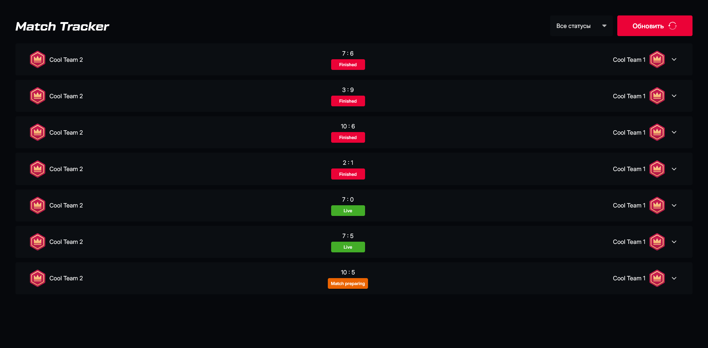

# Match Tracker

Приложение для отслеживания матчей в реальном времени. Match Tracker позволяет пользователям просматривать информацию о текущих, запланированных и завершенных матчах, включая составы команд, счет и статистику игроков.



## Функциональность

- Отображение списка матчей с различными статусами (Live, Match preparing, Finished)
- Детальная информация о командах и игроках
- Фильтрация матчей по статусу
- Заглушка для мобильных устройств
- Анимации загрузки для улучшения пользовательского опыта

## Технологии

### Фронтенд

- **React 19** - современная библиотека для создания пользовательских интерфейсов
- **TypeScript** - типизированный JavaScript для повышения надежности кода
- **Tailwind CSS v4** - утилитарный CSS-фреймворк для быстрой стилизации
- **TanStack Query (React Query)** - библиотека для управления серверным состоянием
- **Vite** - быстрый инструмент сборки для современных веб-приложений

### Архитектура и подходы

- **Компонентный подход** - разделение UI на переиспользуемые компоненты
- **Atomic Design** - организация компонентов по принципу атомарного дизайна
- **CSS Animations** - анимации для улучшения UX
- **CSS Variables** - использование CSS-переменных для темизации и управления стилями
- **Controlled Components** - управляемые компоненты для форм и элементов ввода
- **Custom Hooks** - выделение логики в пользовательские хуки для повторного использования
- **Conditional Rendering** - условный рендеринг для различных состояний UI
- **Skeleton Loading** - использование скелетонов для индикации загрузки данных
- **Type-safe Development** - строгая типизация для предотвращения ошибок на этапе разработки

## Структура проекта

```
src/
├── app/              # Основные компоненты приложения
├── components/       # Переиспользуемые компоненты
│   ├── ui/           # Базовые UI компоненты
│   └── icons/        # SVG иконки
├── hooks/            # Пользовательские хуки
├── interfaces/       # TypeScript интерфейсы
├── types/            # TypeScript типы
└── utils/            # Вспомогательные функции
```

## Запуск проекта

### Предварительные требования

- Node.js 18+
- npm или yarn

### Установка зависимостей

```bash
npm install
# или
yarn install
```

### Запуск в режиме разработки

```bash
npm run dev
# или
yarn dev
```

Приложение будет доступно по адресу [http://localhost:5173](http://localhost:5173)

### Сборка для продакшена

```bash
npm run build
# или
yarn build
```

## Деплой

Приложение можно развернуть на любой платформе, поддерживающей статический хостинг (Vercel, Netlify, GitHub Pages и т.д.).

## API

Приложение использует REST API для получения данных о матчах. Документация API доступна в формате Swagger:

```
/swagger.yaml
```

## Автор

**Dmitry Pavlenko** - Frontend Developer

- Telegram: [@pavlenkodim99](https://t.me/pavlenkodim99)
- GitHub: [github.com/pavlenkodim](https://github.com/pavlenkodim)
- Email: pavlenkodim@mail.ru
- LinkedIn: [linkedin.com/in/dmitry-pavlenko-04418b2b3](https://linkedin.com/in/dmitry-pavlenko-04418b2b3)
